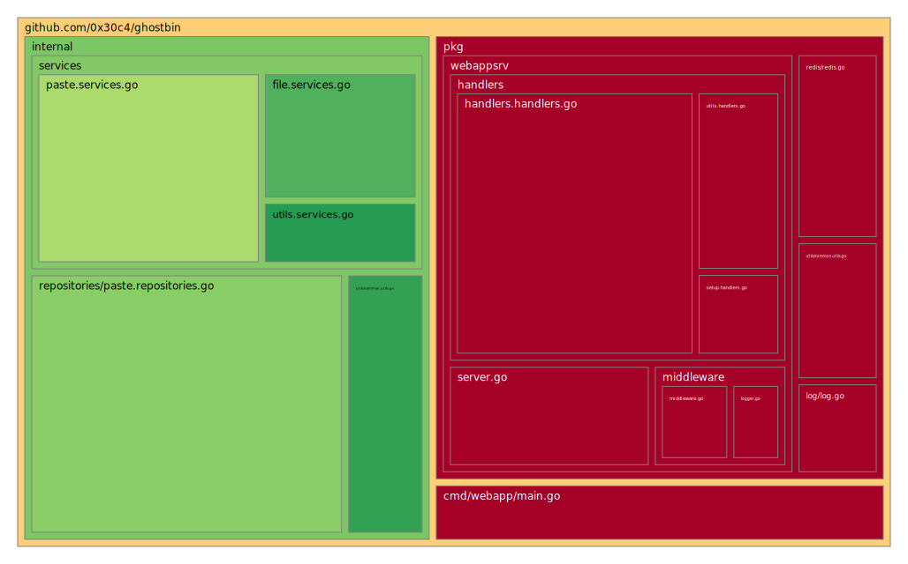

<h1 align="center">GhostBin</h1>
<p align="center">
  
</p>
<p align="center">
  
</p>
<p align="justify">
  GhostBin is a lightweight, high-performance pastebin built with Go and Redis. Designed with simplicity and speed in mind, GhostBin offers a fast and efficient platform for sharing text snippets effortlessly.
</p>
<p align="center">
  <a href="mailto:support@gbin.me"> support@gbin.me </a>
</p>

## Table of Contents

- [How To Use GhostBin](#how-to-use-ghostbin)
  - [Basic Usage](#basic-usage)
  - [Pipe Output of a Command](#pipe-output-of-a-command)
  - [Burn and Expire](#burn-and-expire)
  - [Secure Deletion](#secure-deletion)
  - [Example](#example)
- [Deployment](#deployment)
  - [Built With](#built-with)
  - [Prerequisites](#prerequisites)
  - [Docker Compose](#docker-compose)
  - [Contributing](#contributing)
  - [License](#license)
- [Test](#test)
  - [Test Coverage](#current-test-coverage)
- [TODO](#todo)
- [Contribution](#contribution)
- [Donate](#donate)

## How To Use GhostBin

### Basic Usage

```bash
# Upload a file
$ curl -F "f=@filename.ext" gbin.me
```

### Pipe Output of a Command

```bash
# Pipe output of a command
$ cat file | curl -F "f=@-" gbin.me
$ find /var/log/nginx -name "*.log" | curl -F "f=@-" gbin.me
```

### Burn and Expire

```bash
# Paste will expire after 69 seconds
$ curl -F "f=@filename.ext" -F "expire=69" gbin.me

# Paste will expire after 3 reads
$ curl -F "f=@filename.ext" -F "read=3" gbin.me

# Set a custom URL length
$ curl -F "f=@filename.ext" -F "deepurl=3" gbin.me
```

### Secure Deletion

```bash
# Set a secret for deletion
$ curl -F "f=@filename.ext" -F "secret=password" gbin.me

# Delete paste using secret
$ curl -XDELETE -F "secret=password" gbin.me/pasteid
```

### Example

```bash
# Create a paste with specific settings
$ curl -F "f=@filename.ext" -F "deepurl=12" -F "expire=69" -F "read=1" gbin.me
```

For more details and advanced usage, please refer to the [documentation](https://gbin.me).

## Deployment
Want to run a server like this? clone it! Remember centralization is bad.

### Built With.

* [Docker](https://www.docker.com) - Platform and Software Deployment
* [Go](https://go.dev) - Backend Frame-work.
* [Redis](https://redis.io/) - DataStore DataStore

### Prerequisites.

Make sure you have [git](https://git-scm.com/book/en/v2/Getting-Started-Installing-Git), [make](https://tldp.org/HOWTO/Software-Building-HOWTO-3.html) and [Docker](https://www.docker.com/products/docker-desktop) installed.

### Docker Compose

GhostBin can be easily deployed using Docker Compose. Follow these steps to deploy GhostBin:

1. **Clone Repository**: Clone the GhostBin repository to your server.

2. **Configuration**: Duplicate the `env-example` file and rename it as `.env.dev` for local development or `.env.prod` for the production environment. Customize the contents of these files according to your requirements.

3. **Build**: Build the Docker images for GhostBin using the provided Makefile command:

    ```bash
    make build
    ```

4. **Development Environment**:

    ```bash
    make up-dev
    ```

5. **Production Environment**:

    ```bash
    make up-prod
    ```

6. **Access Logs**:

    To access logs, you can use:

    ```bash
    make logs
    ```

    To tail logs in real-time:

    ```bash
    make logs-tail
    ```

7. **Additional Commands**:

    - `make down-dev` / `make down-prod`: Shutdown the development/production environment.
    - `make restart-dev` / `make restart-prod`: Restart the development/production environment.
    - `make exec-dev` / `make exec-prod`: Access the shell of the development/production container.

## Test
I am presently working on writing the unit tests. 🫠

### Current Test Coverage


## TODO
  - Write test for handlers
  - Refactor the code
  - Write a pastebin client with shell script
  - Write file delete daemon

## Contributing

Contributions to GhostBin are welcome! If you find any issues or have suggestions for improvements, please feel free to open an issue or submit a pull request on our [GitHub repository](https://github.com/0x30c4/GhostBin).

## License

GhostBin is licensed under the [BSD 3-Clause License](https://github.com/0x30c4/GhostBin/blob/main/LICENSE).


## Contribution
Pull requests are welcome.

For major changes, please open an issue first to discuss what you would like to change.

## Donate
You can support this project via Liberapay.
The monthly hosting cost is right now 12 Dollar.
<br>
<a target="_blank" href="https://liberapay.com/sanaf/donate"></a>

Monero wallet address: 83BDAy6tN99PVud2sUnjyoMzsUDdXJCoMjjwJ59cVwPF91RccxLWCVsfD9imMqxUaMhMG1brzuVBeAM4KREUSf9U9efbKx1
